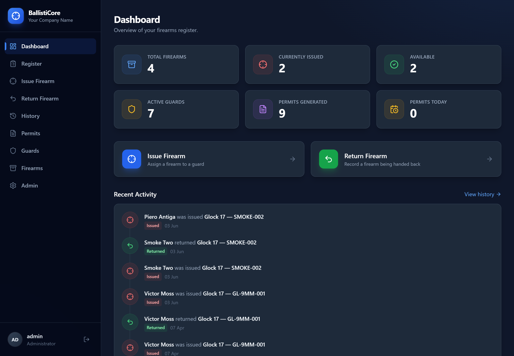
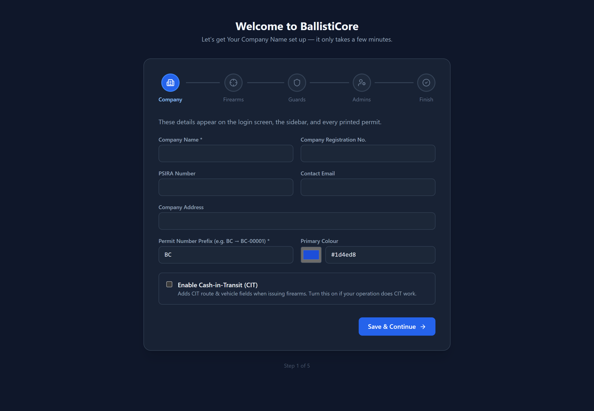
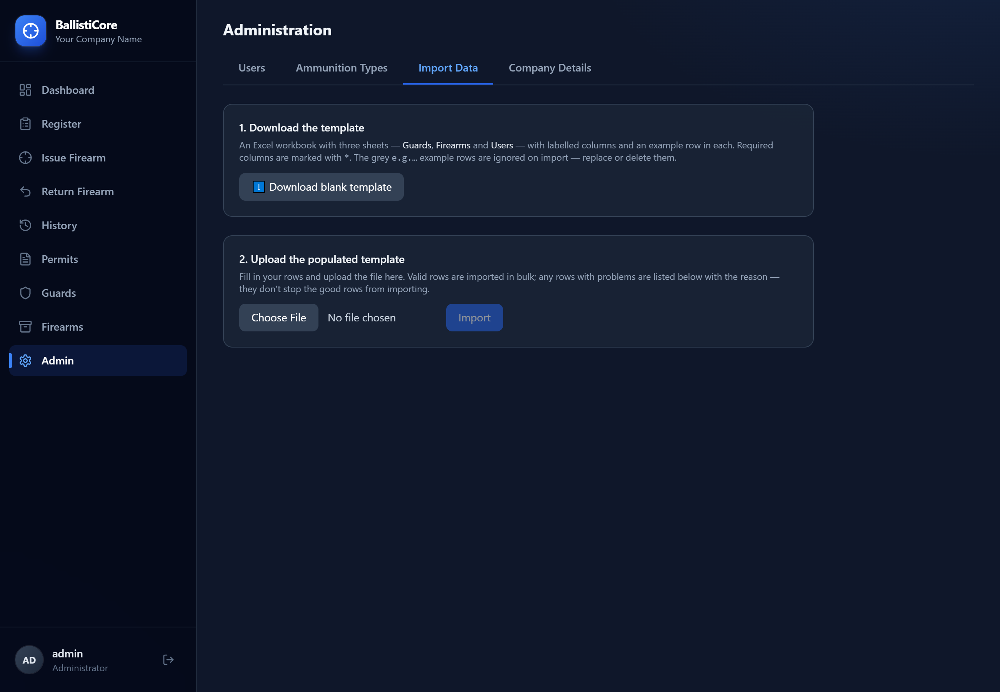

# BallistiCore

**Self-hosted firearms register management for security companies.** Issue and
return firearms, track guards and permits, generate printable firearm permits,
and run it entirely on one Windows PC — no cloud, no subscription, and your data
stays on your premises.

[](https://github.com/Victor-Moss/Ballisticore/releases/latest)

## Download

Get the latest Windows installer from the
**[Releases page](https://github.com/Victor-Moss/Ballisticore/releases/latest)**:

➡️ **[BallistiCore 1.4.0 — download the installer](https://github.com/Victor-Moss/Ballisticore/releases/tag/v1.4.0)**

The installer bundles everything (Python, PostgreSQL and the web app). Run it,
follow the first-time setup wizard, and BallistiCore opens in your browser.
First login is `admin` / `admin1234` — **change it immediately** under
Admin → Users.

## Features

### New in 1.4.0
- **Granular permissions** — all 12 user permissions are now enforced. Each
  operator sees only the menu items their permissions grant; navigating directly
  to a blocked page shows an Access Denied screen. The same rules are enforced on
  the server, not just hidden in the UI, so they can't be bypassed. As a safeguard,
  only a System Admin can create or grant another System Admin — operators with
  "Add Users" are limited to standard operator-level accounts.

### Also included
- **Light / dark theme** *(1.3.0)* — a theme toggle in the top navigation bar,
  remembering your choice. Dark is the default; the light theme uses clean whites
  and light greys with dark text, keeping the same steel-blue accent.
- **Dashboard** *(1.2.0)* — key stats at a glance: Total Firearms, Firearms
  Currently Issued, Available Firearms, Active Guards, Total Permits Generated
  and Permits Issued Today — plus a clean timeline of the last 10 firearm issues
  and returns.
- **First-Time Setup wizard** *(1.1.0)* — a 5-step guided first run: Company
  Details (with a Cash-in-Transit toggle), Firearms, Guards, Admin Users, and a
  completion screen. It also shows how other PCs on your network can reach the
  server via this machine's local IP address. Never shows again once completed.
- **Excel bulk import** *(1.1.0)* — download a Guards / Firearms / Users template,
  fill it in, and import in bulk. Invalid rows are reported with their sheet, row
  number and reason, and never block the valid rows from importing.
- **Firearms register** — issue and return firearms to guards with electronic
  guard signatures, ammunition tracking, and full history.
- **Permits** — auto-generated permit PDFs with optional WhatsApp delivery via
  Twilio (outbound only).
- **Admin** — users & permissions, ammunition types, and company branding.
- **Self-hosted, offline, local** *(1.0.0)* — bundled Python + PostgreSQL; all
  data stays on the machine. The only outbound traffic is optional Twilio
  WhatsApp, and only when configured.

## Screenshots

<table>
  <tr>
    <td width="33%" valign="top" align="center">
      <a href="docs/dashboard.png"></a>
      <br><sub><b>Dashboard</b> — key stats &amp; recent activity</sub>
    </td>
    <td width="33%" valign="top" align="center">
      <a href="docs/wizard.png"></a>
      <br><sub><b>First-Time Setup wizard</b> — guided 5-step first run</sub>
    </td>
    <td width="33%" valign="top" align="center">
      <a href="docs/import.png"></a>
      <br><sub><b>Excel bulk import</b> — template + per-row validation</sub>
    </td>
  </tr>
</table>

_Click any screenshot to view it full size._

## How it runs

A single FastAPI process serves both the JSON API and the React UI on
`http://localhost:8000`, backed by a local PostgreSQL instance. The installer is
per-user (no administrator rights required) and a launcher starts everything on
demand and opens your browser.

## For developers

- **Backend:** FastAPI + SQLAlchemy + Alembic (PostgreSQL) — `BallistiCore_app/backend`
- **Frontend:** React + Vite + Tailwind — `BallistiCore_app/frontend`
- **Installer:** Inno Setup — see **[installer/BUILD.md](installer/BUILD.md)** to
  assemble and compile the Windows installer.

```bash
# Backend (from BallistiCore_app/backend, with a .env and PostgreSQL running)
uvicorn app.main:app --reload

# Frontend (from BallistiCore_app/frontend)
npm install && npm run dev
```

## Releases

| Version | Highlights |
| --- | --- |
| [1.4.0](https://github.com/Victor-Moss/Ballisticore/releases/tag/v1.4.0) | Granular permission enforcement + System Admin escalation guard · installer smoke-tested ✅ |
| [1.3.0](https://github.com/Victor-Moss/Ballisticore/releases/tag/v1.3.0) | Light / dark theme toggle · installer smoke-tested ✅ |
| [1.2.0](https://github.com/Victor-Moss/Ballisticore/releases/tag/v1.2.0) | Dashboard — key stats + recent-activity timeline |
| [1.1.0](https://github.com/Victor-Moss/Ballisticore/releases/tag/v1.1.0) | First-Time Setup wizard, Excel bulk import |
| [1.0.0](https://github.com/Victor-Moss/Ballisticore/releases/tag/v1.0.0) | Self-hosted Windows installer |
