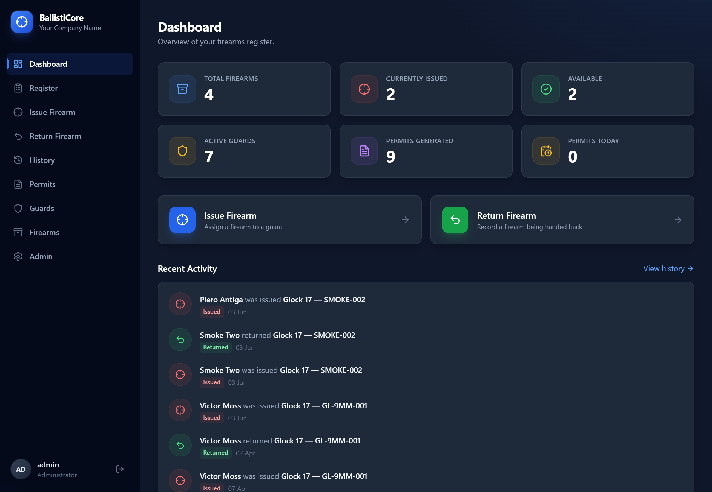
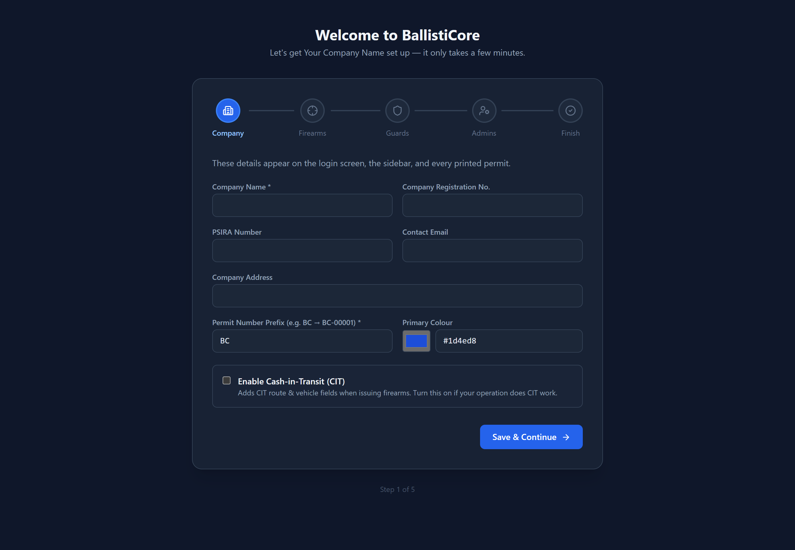
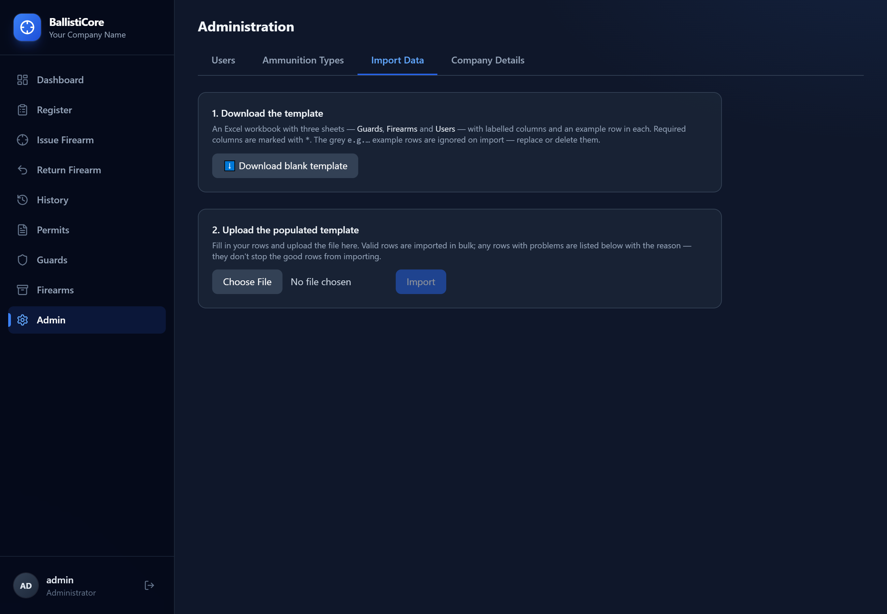

# BallistiCore

**Self-hosted firearms register management for security companies.** Issue and
return firearms, track guards and permits, generate printable firearm permits,
and run it entirely on one Windows PC — no cloud, no subscription, and your data
stays on your premises.

[](https://github.com/Victor-Moss/Ballisticore/releases/latest)

## Download

Get the latest Windows installer from the
**[Releases page](https://github.com/Victor-Moss/Ballisticore/releases/latest)**:

➡️ **[BallistiCore 1.8.0 — download the installer](https://github.com/Victor-Moss/Ballisticore/releases/tag/v1.8.0)**

The installer bundles everything (Python, PostgreSQL and the web app). Run it,
follow the first-time setup wizard, and BallistiCore opens in your browser.
First login is `admin` / `admin1234` — **change it immediately** under
Admin → Users.

## Features

### New in 1.8.0
- **Assign firearms while creating a guard** — pick the guard's firearms from
  inventory on the creation form instead of saving the guard first and going back
  to the edit screen. The guard and their assignments are written in one
  transaction, so a guard can never end up created with weapon types selected but
  no firearm actually assigned.
- **One clearance rule for both assignment paths** — the weapon-type clearance
  check is now shared between guard creation and the edit screen, so an assignment
  that would be refused at the counter can't be stored from either route.
  Assignments already on file are never re-checked or invalidated.
- **CIT permits omit the residential address** — on a Cash-in-Transit install the
  full permit PDF leaves the guard's home address off entirely. Security Company
  permits are unchanged. The address stays on the guard record for SAPS compliance
  either way; it simply isn't printed on a CIT permit.
- **Firearm authorisation is now restricted** — granting or revoking a guard's
  firearm permission requires the **Manage Staff** permission. Previously any
  signed-in user could do either. Viewing permissions is unchanged.
- **Guards with history can no longer be deleted by mistake** — a guard carrying
  register entries, issue history or permits must be **deactivated** rather than
  deleted, so the compliance record they hang off survives. Guards with only
  firearm assignments and no audit history stay deletable as before, and
  deactivating a guard deliberately leaves their firearm assignments intact.
- **Deleting a guard with assigned firearms no longer errors** — this previously
  failed with a 500.
- **Permit delivery routes by company type** — delivery resolves its target from
  the company type and provider: a Cash-in-Transit company sends to the cell
  number on the CIT route, a security company to the individual guard. Missing
  contact details now come back as a named error naming the field to fill in,
  instead of failing silently in the background.

### New in 1.7.0
- **Choose how permits are delivered** — a messaging provider setting picks
  **Telegram**, **WhatsApp** or **None**. Telegram sends to a guard's chat ID,
  WhatsApp to their cell number, and None turns delivery off entirely for sites
  that hand permits over on paper. Guards gained the profile fields each provider
  needs, and delivery routes by company type: a Cash-in-Transit company sends to
  the cell number on the CIT route, a security company to the individual guard.
- **Access from other machines on the network** — the app binds to the LAN so
  staff can reach it at `http://<this-PC-IP>:8000` from another PC on the same
  network. The bundled PostgreSQL stays bound to localhost only.
- **Idle auto-logout** — an unattended session signs itself out rather than
  leaving the register open on a shared machine.
- **Shutdown control** — stop the whole stack from inside the app instead of
  hunting for the Stop shortcut.
- **First-Time Setup wizard permission defaults fixed** — the operator created by
  the wizard now lands with the permissions actually intended, instead of an
  over- or under-privileged account.
- **Login hang fixed** — sign-in no longer stalls indefinitely when the backend
  is slow or unreachable: requests time out, the 401 interceptor no longer loops,
  and offline/timeout conditions surface as a readable error.

### New in 1.6.0
- **Ammunition Types management** — manage the ammunition types your firearms can
  be linked to (e.g. 9mm FMJ, 5.56 NATO) from a new **Ammunition Types** tab on the
  Firearms screen: add, edit, deactivate and reactivate types, with a confirmation
  before removal. Admin-only, matching the other management screens. A firearm's
  ammunition type is snapshotted onto each permit at issue time, so renaming a type
  never rewrites past permits.
- **More fields in Excel import & export** — the import template and the full-data
  export now round-trip four more fields: Guard **Region**, User **Competency**,
  Firearm **Licence Issue Date**, and a Firearm's **Ammunition Type** (matched by
  name against your existing types). The export's Guards sheet picks up Region
  automatically, keeping the import template and the export in lock-step.

### Also included
- **Export All Data** *(1.5.0)* — one admin-only action exports the full dataset as
  an Excel workbook, a CSV bundle and a PDF compliance summary in a single ZIP, with
  a human-readable companion column next to every ID field and an audit-log entry
  per export.
- **SAPS competency import & fully-enforced permissions** *(1.5.0)* — the Guards
  import captures a SAPS Competency + Expiry per weapon type (auto-ticking that
  weapon's permission, surfacing expired-but-valid pairs for review and routing bad
  rows to a downloadable **error workbook**); and every Add/Modify User checkbox is
  enforced on the server, not just the UI. See [PERMISSIONS_MAP.md](PERMISSIONS_MAP.md).
- **Granular permissions** *(1.4.0)* — each operator sees only the menu items
  their permissions grant; navigating directly to a blocked page shows an Access
  Denied screen, and the same rules are enforced on the server, not just hidden
  in the UI. Only a System Admin can create or grant another System Admin —
  operators with "Add Users" are limited to standard operator-level accounts.
- **Light / dark theme** *(1.3.0)* — a theme toggle in the top navigation bar,
  remembering your choice. Dark is the default; the light theme uses clean whites
  and light greys with dark text, keeping the same steel-blue accent.
- **Dashboard** *(1.2.0)* — key stats at a glance: Total Firearms, Firearms
  Currently Issued, Available Firearms, Active Guards, Total Permits Generated
  and Permits Issued Today — plus a clean timeline of the last 10 firearm issues
  and returns.
- **First-Time Setup wizard** *(1.1.0)* — a 5-step guided first run: Company
  Details (with a Cash-in-Transit toggle), Firearms, Guards, Admin Users, and a
  completion screen. It also shows how other PCs on your network can reach the
  server via this machine's local IP address. Never shows again once completed.
- **Excel bulk import** *(1.1.0)* — download a Guards / Firearms / Users template,
  fill it in, and import in bulk. Invalid rows are reported with their sheet, row
  number and reason, and never block the valid rows from importing.
- **Firearms register** — issue and return firearms to guards with electronic
  guard signatures, ammunition tracking, and full history.
- **Permits** — auto-generated permit PDFs with optional WhatsApp delivery via
  Twilio (outbound only).
- **Admin** — users & permissions and company branding. (Ammunition types are
  managed on the Firearms screen — see 1.6.0 above.)
- **Self-hosted, offline, local** *(1.0.0)* — bundled Python + PostgreSQL; all
  data stays on the machine. The only outbound traffic is optional Twilio
  WhatsApp, and only when configured.

## Screenshots

<table>
  <tr>
    <td width="33%" valign="top" align="center">
      <a href="docs/dashboard.png"></a>
      <br><sub><b>Dashboard</b> — key stats &amp; recent activity</sub>
    </td>
    <td width="33%" valign="top" align="center">
      <a href="docs/wizard.png"></a>
      <br><sub><b>First-Time Setup wizard</b> — guided 5-step first run</sub>
    </td>
    <td width="33%" valign="top" align="center">
      <a href="docs/import.png"></a>
      <br><sub><b>Excel bulk import</b> — template + per-row validation</sub>
    </td>
  </tr>
</table>

_Click any screenshot to view it full size._

## How it runs

A single FastAPI process serves both the JSON API and the React UI on
`http://localhost:8000`, backed by a local PostgreSQL instance. The installer is
per-user (no administrator rights required) and a launcher starts everything on
demand and opens your browser.

## For developers

- **Backend:** FastAPI + SQLAlchemy + Alembic (PostgreSQL) — `BallistiCore_app/backend`
- **Frontend:** React + Vite + Tailwind — `BallistiCore_app/frontend`
- **Installer:** Inno Setup — see **[installer/BUILD.md](installer/BUILD.md)** to
  assemble and compile the Windows installer.

```bash
# Backend (from BallistiCore_app/backend, with a .env and PostgreSQL running)
uvicorn app.main:app --reload

# Frontend (from BallistiCore_app/frontend)
npm install && npm run dev
```

## Releases

| Version | Highlights |
| --- | --- |
| [1.8.0](https://github.com/Victor-Moss/Ballisticore/releases/tag/v1.8.0) | Inline firearm assignment at guard creation, unified weapon-type clearance validation, CIT permits omit the residential address, Manage Staff gate on firearm authorisation, hard-delete blocked for guards with audit history · installer smoke-tested ✅ |
| [1.7.0](https://github.com/Victor-Moss/Ballisticore/releases/tag/v1.7.0) | Messaging provider selection (Telegram / WhatsApp / None) with CIT-vs-security delivery routing, LAN access, idle auto-logout, in-app shutdown, wizard permission-default and login-hang fixes · installer smoke-tested ✅ |
| [1.6.0](https://github.com/Victor-Moss/Ballisticore/releases/tag/v1.6.0) | Ammunition Types management on the Firearms screen; Region / Competency / Licence Issue Date / Ammunition Type added to Excel import & export · installer smoke-tested ✅ |
| [1.5.0](https://github.com/Victor-Moss/Ballisticore/releases/tag/v1.5.0) | SAPS competency & PSIRA in Excel import, full data export (Excel + CSV + PDF), fully-enforced permissions · installer smoke-tested ✅ |
| [1.4.0](https://github.com/Victor-Moss/Ballisticore/releases/tag/v1.4.0) | Granular permission enforcement + System Admin escalation guard · installer smoke-tested ✅ |
| [1.3.0](https://github.com/Victor-Moss/Ballisticore/releases/tag/v1.3.0) | Light / dark theme toggle · installer smoke-tested ✅ |
| [1.2.0](https://github.com/Victor-Moss/Ballisticore/releases/tag/v1.2.0) | Dashboard — key stats + recent-activity timeline · installer smoke-tested ✅ |
| [1.1.0](https://github.com/Victor-Moss/Ballisticore/releases/tag/v1.1.0) | First-Time Setup wizard, Excel bulk import · installer smoke-tested ✅ |
| [1.0.0](https://github.com/Victor-Moss/Ballisticore/releases/tag/v1.0.0) | Self-hosted Windows installer · installer smoke-tested ✅ |
